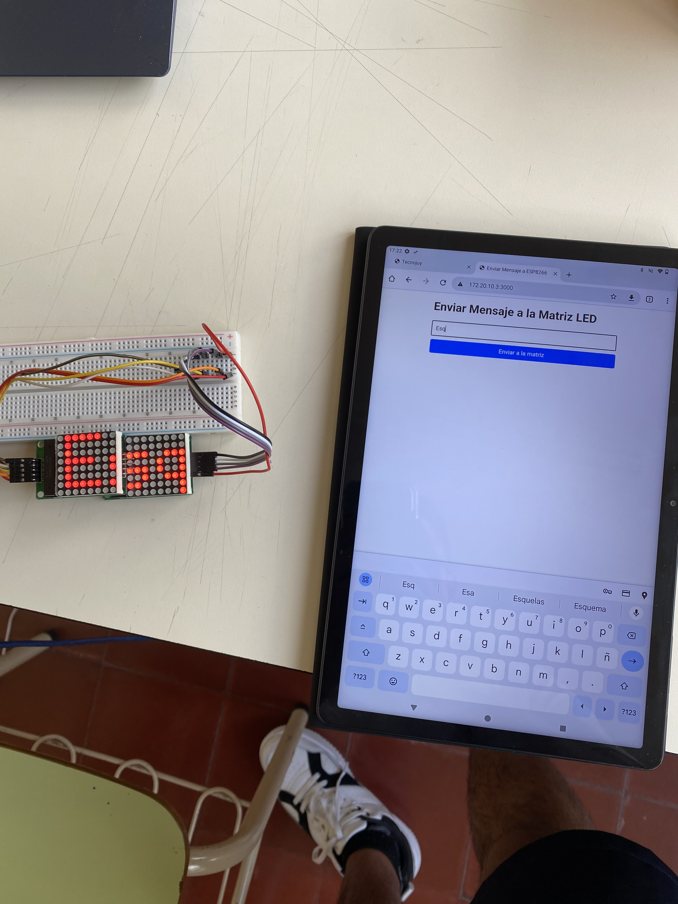
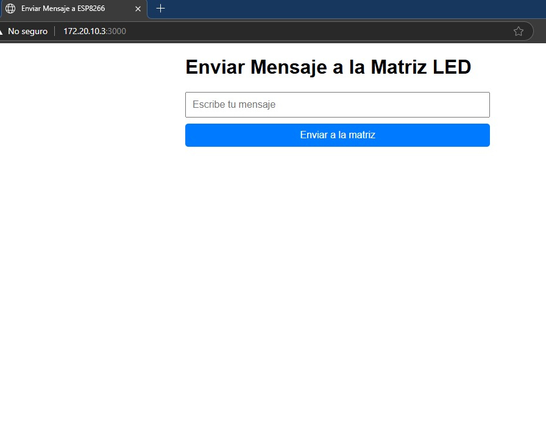

# Proyecto Matriz LED con ESP8266

Este proyecto implementa un sistema de visualización de mensajes en una matriz LED controlada por ESP8266, con una interfaz web para el envío de mensajes.

## 🚀 Características

- Interfaz web para envío de mensajes
- Servidor Node.js con Hono
- Visualización en matriz LED MAX7219
- Comunicación en tiempo real

## 📋 Requisitos

- Node.js v18 o superior
- Arduino IDE
- ESP8266
- Matriz LED MAX7219
- Conexión WiFi

## 🛠️ Instalación

1. Clonar el repositorio:

bash
git clone https://github.com/tecnojuy/proyecto-matriz-led-hono-esp8266

2. Instalar dependencias:

bash
npm install

3. Configurar el ESP8266:
   - Abrir el archivo `ESP8266/mensaje_receiver/mensaje_receiver.ino` en Arduino IDE
   - Configurar las credenciales WiFi
   - Cargar el código al ESP8266

4. Iniciar el servidor:

bash
npm start

## 📁 Estructura del Proyecto

- `/src`: Código del servidor
- `/public`: Archivos estáticos y frontend
- `/ESP8266`: Código para el microcontrolador
- `/docs`: Documentación, imágenes y videos

## 📷 Documentación Visual

### Montaje del Hardware

  
  

### Demostración en Funcionamiento

  

## 🎥 Video Demostrativo

https://github.com/user-attachments/assets/eebd62f1-1649-4175-b708-e9e326963a1f

## ✍️ Autor

Juan Javier Bejarano

## 📄 Licencia

ISC
